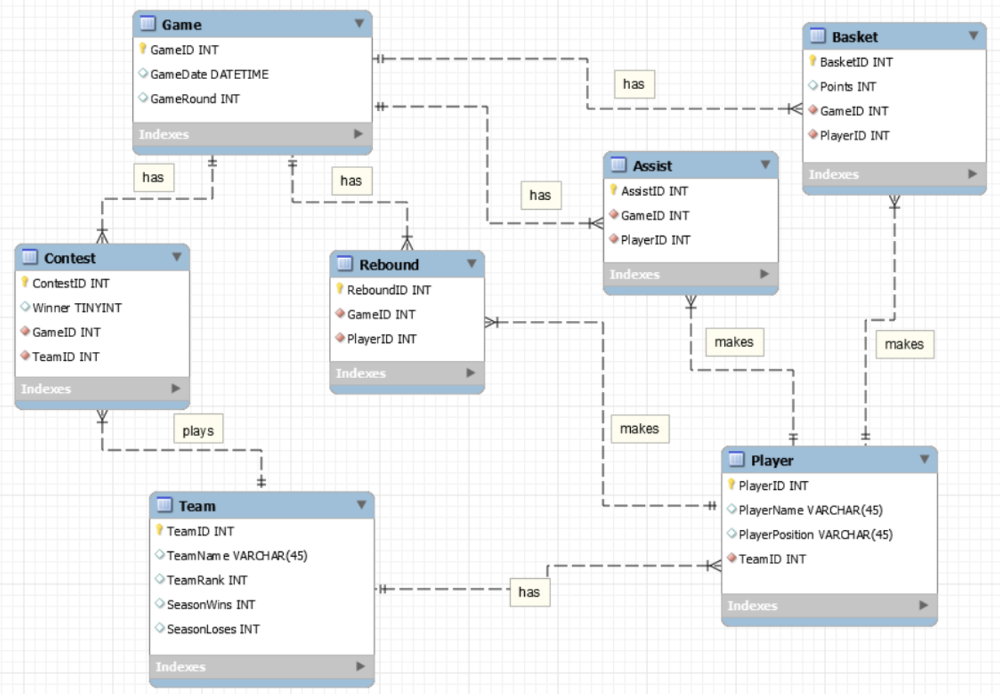
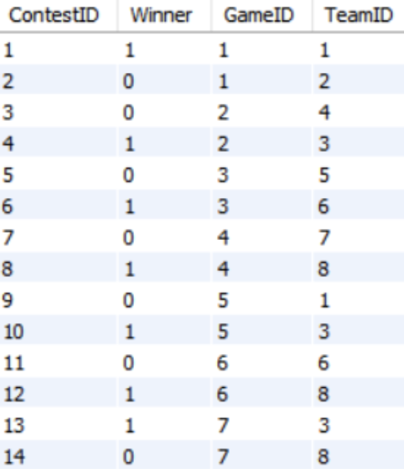
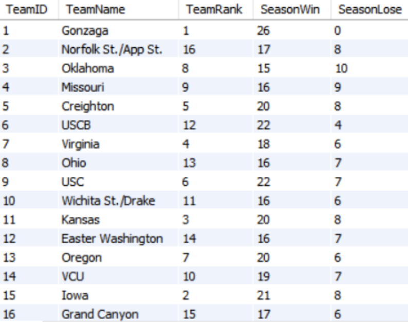
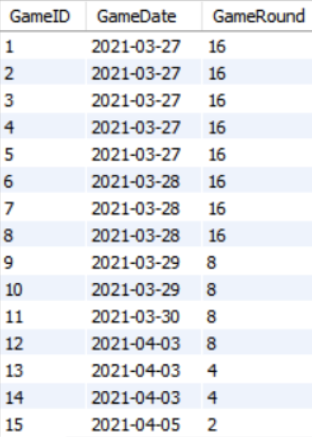
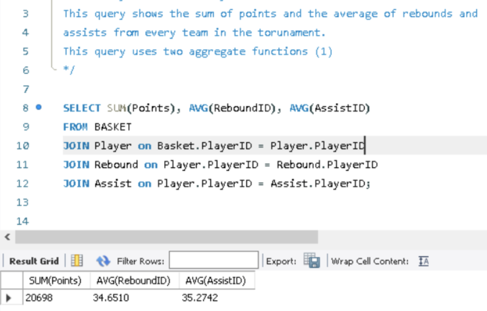
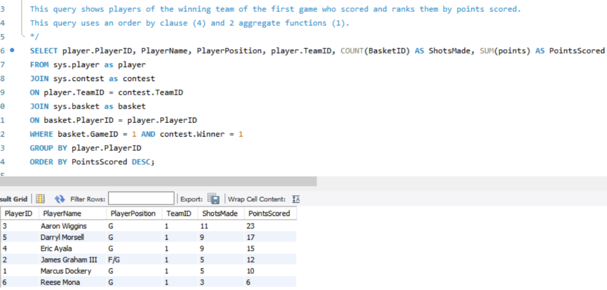
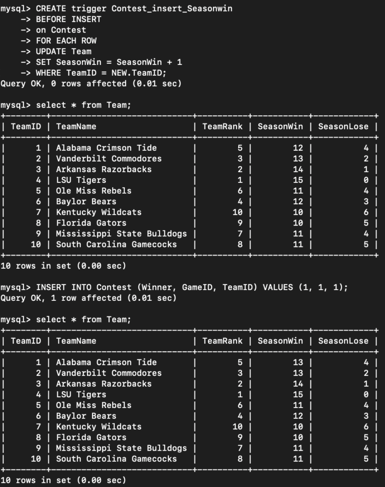

# NCAA_College_Basketball_Database

## Description
NCAA College Basketball Database is a SQL-based database that allows users to establish an initial database through SQL files and Statements. Users can insert data into the database or use the data as a case. It uses different tables to store and distinguish player, team, and game data. Users can find and name existing data, and use triggers to associate data in different tables so that they can be updated automatically.

---

## Business Summary
1. Round attribute handles keeping track of teams’ progress in the tournament
2. Tables hold information regarding:
    * Games
    * Teams
    * Players
    * Points
    * Rebounds
    * Assists

---
## Business Rules
1. Every contest has exactly two teams
2. Every player has one team
3. Each contest has one winner
4. If a team loses they are eliminated and have no more games
5. A team’s rank does not change throughout all of the games
---
## ERD
<center>
    
</center>

---
## Getting Started

### Dependencies
1. Download and install [MySQL Database Service](https://www.mysql.com/downloads/)
2. Download ```DB_DDL.sql``` and ```DB_DML.sql```

### Initialize the Database
* Executing SQL Statements from ```DB_DDL.sql```

### Insert Sample Data
* Executing SQL Statements from ```DB_DML.sql```

---
## Demo
### Sample Data
<center>
    
</center>
<center>
    
</center>
<center>
    
</center>

---

### Sample Queries
<center>
    
</center>
<center>
    
</center>

---

### Sample Trigger
<center>
    
</center>